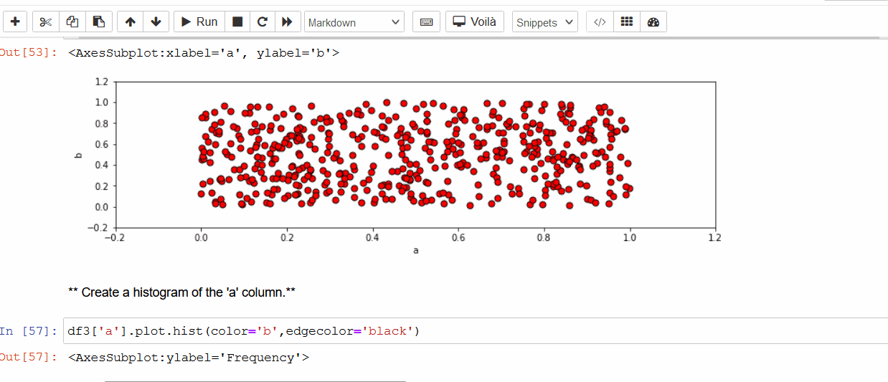

# SimpleAnalysisProject

## 📝 Overview

Simple indepth anaysis of 3 different datasets done individually using different visualization libraries.

  
## 🖥️ Installation
### 🛠️ Requirement

* Plotly
* Seaborn
* Matplotlib
* Pandas

    
## ⚙️ Tech Stack

